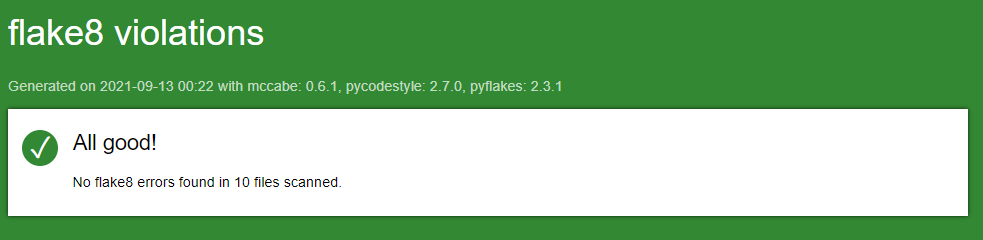

# Projet 4 DA-Python OC (Hélène Mignon)
***Livrable du Projet 4 du parcours D-A Python d'OpenClassrooms : application de gestion de tournoi d'échecs avec base de données.***

_Testé sous Windows 10 - Python version 3.9.5_

## Table des matières

1. [Initialisation du projet](#id-section1)
    1. [Windows](#id-section1-1)
    1. [MacOS et Linux](#id-section1-2)
    3. [Générer un rapport flake8](#id-section1-3)
2. [Options des menus](#id-section2)
    1. [Menu principal](#section2-1)
    2. [Rapports](#section2-2)

## 1. Initialisation du projet

#### i. Windows :
Dans Windows Powershell, naviguer vers le dossier souhaité.
###### Récupération du projet

    $ git clone https://github.com/hmignon/P4_mignon_helene.git

###### Activer l'environnement virtuel
    $ cd P4_mignon_helene 
    $ python -m venv env 
    $ ~env\scripts\activate
    
###### Installer les paquets requis
    $ pip install -r requirements.txt

###### Lancer le programme
    $ python main.py

---------

#### ii. MacOS et Linux :
Dans le terminal, naviguer vers le dossier souhaité.
###### Récupération du projet

    $ git clone https://github.com/hmignon/P4_mignon_helene.git

###### Activer l'environnement virtuel
    $ cd P4_mignon_helene 
    $ python3 -m venv env 
    $ source env/bin/activate
    
###### Installer les paquets requis
    $ pip install -r requirements.txt

###### Lancer le programme
    $ python3 main.py

----------

#### iii. Générer un rapport flake8

    $ flake8 --format=html --htmldir=flake8_report

**Vous trouverez le rapport dans le dossier _'flake8-report'_.**

_Dernier rapport exporté :_

## 2. Options des menus

#### i. Menu Principal
1. Créer un nouveau tournoi
2. Reprendre tournoi existant
3. Créer un nouveau joueur
4. Modifier un joueur existant
5. Rapports

#### ii. Rapports
1. Tous les joueurs
   1. Classer par nom
   2. Classer par rang
2. Tous les joueurs d'un tournoi
   1. Classer par nom
   2. Classer par rang
3. Tous les tournois
4. Toutes les rondes d'un tournoi
5. Tous les matchs d'un tournoi